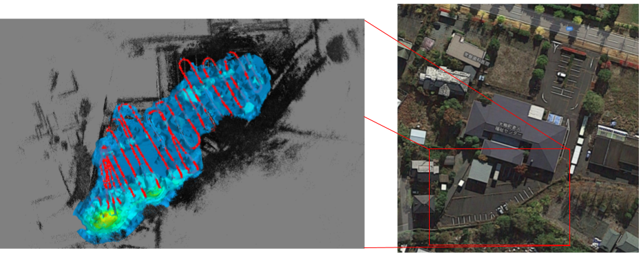
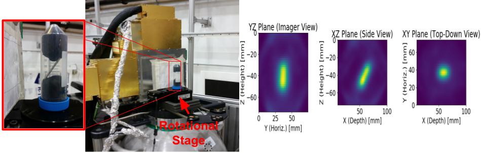
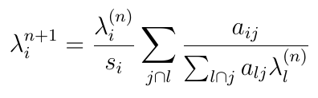

---
jupytext:
  text_representation:
    extension: .md
    format_name: myst
    format_version: 0.13
    jupytext_version: 1.13.1
kernelspec:
  display_name: Python 3 (ipykernel)
  language: python
  name: python3
rise:
  theme: serif
---

```{code-cell} ipython3
---
slideshow:
  slide_type: '-'
---
import numpy as np
import scipy as sp  # Subpackages still need to be imported individually
import matplotlib.pyplot as plt
from matplotlib import cm
import tables
```

```{code-cell} ipython3
---
slideshow:
  slide_type: '-'
tags: [remove-cell]
---
# For presentation
%matplotlib notebook
```

```{code-cell} ipython3
---
slideshow:
  slide_type: skip
---
# For website
%matplotlib inline
```

+++ {"slideshow": {"slide_type": "slide"}}

# Python: the language for effective scientific computing

[Ross Barnowski](https://bids.berkeley.edu/people/ross-barnowski) `rossbar@berkeley.edu` | [@rossbar](https://github.com/rossbar) on GitHub

DOE Python Exchange | 12/01/2021

+++ {"slideshow": {"slide_type": "slide"}}

## The Question: Why Python

+++ {"slideshow": {"slide_type": "fragment"}}

 - My personal take

+++ {"slideshow": {"slide_type": "fragment"}}

 - Looking ahead...

+++ {"slideshow": {"slide_type": "slide"}}

## A bit about me...

+++ {"slideshow": {"slide_type": "subslide"}}

I began my research career in the national lab system:

+++ {"slideshow": {"slide_type": "fragment"}}

 - Summer 2008: SULI internship at Argonne National Laboratory

+++ {"slideshow": {"slide_type": "fragment"}}

 - Summer 2009: Summer internship with the Nuclear Data Group at LLNL
   * First exposure to Python

+++ {"slideshow": {"slide_type": "fragment"}}

 - 2010-2019: Grad school -> post-doc -> research scientist & lecturer
   * UC Berkeley nuclear engineering department & the Applied Nuclear Physics
     group at LBNL

+++ {"slideshow": {"slide_type": "subslide"}}

I'm a nuclear engineer by training, specializing in radiation instrumentation;
particularly gamma-ray spectroscopy and imaging.

+++ {"slideshow": {"slide_type": "fragment"}}

Open-source software, specifically scientific Python, was **the** key component
in my research projects.

+++ {"slideshow": {"slide_type": "subslide"}}

### Real-time 3D gamma-ray mapping
 - Scene data fusion (SDF): computer vision + gamma-ray imaging
 - Applications in e.g. nuclear contamination remediation

<center>
  
</center>

**Right:** *Aerial view of measurement area.* **Left:** *3D gamma-ray image reconstruction — Red line = path of imager through the scene, B/W dots = 3D point cloud model of the scene, Heatmap = image reconstruction; color scale corresponds to relative reconstructed intensity.*

+++ {"slideshow": {"slide_type": "subslide"}}

### Volumetric gamma-ray imaging
 - Imaging modalities for e.g. nuclear safeguards or small-animal imaging

<center>
  
</center>

*Demonstration of Compton imaging for applications in small animal molecular imaging.* **Left:** *A Cs-137 calibration source in the shape of a thin rod mounted on a rotating stage.* **Right:** *Three projections of reconstructed image from a tomographic measurement.*

+++ {"slideshow": {"slide_type": "slide"}}

## My background

+++ {"slideshow": {"slide_type": "fragment"}}

- Systems integration
  * Interfacing with hardware, data acquisition systems
  * Synchronizing & fusing data from disparate sources

+++ {"slideshow": {"slide_type": "fragment"}}

- Real-time acquisition and analysis
  * Distributed computing: performance, load-balancing

+++ {"slideshow": {"slide_type": "fragment"}}

- Workstation-scale computing
  * Mobile (hand-held or cart-based) measurement systems
  * Datasets usually O(GB) - not big data

+++ {"slideshow": {"slide_type": "slide"}}

## On to the question: Why Python?

- General-purpose language: can address a wide range of problems & computational tasks
- Optimizes developer time
- Effective language for the communication of scientific ideas
- Community-based development model!

+++ {"slideshow": {"slide_type": "slide"}}

## General purpose programming language

> [This is] a distinguishing feature of Python for science and one of the
> reasons why it has been so successful in the realm of data science: instead
> of adding general features to a language designed for numerical and
> scientific computing, here scientific features are added to a general-purpose
> language. This **broadens the scope of problems** that can be addressed easily,
> **expands the sources of data** that are readily accessible and **increases the
> size of the community that develops code for the platform**.
>
> [Scipy 1.0: fundamental algorithms for scientific computing in Python][scipy_paper]
 
\* Emphasis mine

**See also:** [Jim Hugunin's position paper][hugunin] laying out the motivation
and design principles for `Numeric` (ancestor of NumPy) in 1995(!)

[scipy_paper]: https://www.nature.com/articles/s41592-019-0686-2
[hugunin]: http://hugunin.net/papers/hugunin95numpy.html

+++ {"slideshow": {"slide_type": "subslide"}}

### Integrating with other languages

+++ {"slideshow": {"slide_type": "fragment"}}

- *Performance* - e.g. writing performance-critical chunks in low-level languages

+++ {"slideshow": {"slide_type": "fragment"}}

- *Extending* - adding custom algorithms or data structures (e.g. `ndarray`)

+++ {"slideshow": {"slide_type": "fragment"}}

- *Wrapping* - providing convenient, high-level interfaces to existing low-level code
  * Common in e.g. `scipy` (BLAS, Eigen, etc.)
  * **Legacy code** and software from vendors, e.g. commercial hardware

+++ {"slideshow": {"slide_type": "fragment"}}

A fundamental feature of Python, and many additional tools to fit various use-cases:
 - Cython, Pythran, numba, PyBind11, ...

+++ {"slideshow": {"slide_type": "subslide"}}

```cpp
#include <Python.h>
#include "numpy/arrayobject.h" // provides the numpy C API

...  // Defining all the wrapper functions

static PyMethodDef SISMethods[] = {
    {"connectToDAQ", (PyCFunction)wrap_connectToDAQ, METH_VARARGS, "Connect to SIS3150"},
    {"configuration", (PyCFunction)wrap_configuration, METH_VARARGS, "Configure SIS3302"},
    {"startacquisition", (PyCFunction)wrap_startacquisition, METH_VARARGS, "Start SIS3302"},
    {"stopacquisition", (PyCFunction)wrap_stopacquisition, METH_VARARGS, "Stop SIS3302"},
    {"acquiredata", (PyCFunction)wrap_acquiredata, METH_VARARGS, "Acquire data from SIS3302"},
    {"acquireDataWithRaw", (PyCFunction)wrap_acquireDataWithRaw, METH_VARARGS, "Acquire edata and rdata from SIS3302"},
    {NULL,NULL} 
};

PyMODINIT_FUNC initsis(void) { // must be init<modulename> (init_cext => _cext)
    (void) Py_InitModule("sis", SISMethods);
    import_array(); // load numpy (effectively "import numpy") for use in this module 
};
```

Original wrapping work by Cameron Bates ([@crbates](https://github.com/crbates)), now at LANL, whom I credit with convincing me of the value of the Python C/API!

+++ {"slideshow": {"slide_type": "subslide"}}

```python
import time
from SIS import sis

class SISDAQThread:
    def __init__(self, config_file):
        self.hardware_started = False
        self.paused = True  # state controlled via GUI button press
        # Initialize hardware communication
        sis.connectToDAQ()
        sis.configuration(config_file)

    def run(self):
        if not self.hardware_started and not self.paused:
            self.start_hardware()

        if self.hardware_started and not self.paused:
            timestamps, energies, channel_nos, trigger_values = sis.acquiredata()

        # Validation + send to other processes for analysis

    def start_hardware(self):
        sis.startacquisition()
        self.start_time = time.time()
        self.hardware_started = True
```

+++ {"slideshow": {"slide_type": "fragment"}}

- Incorporate into scripts, local GUIs, Web-UI

+++ {"slideshow": {"slide_type": "fragment"}}

- Instantly gained platform-independence

+++ {"slideshow": {"slide_type": "slide"}}

## Optimize Developer time

> Syntactically, Python code looks like executable pseudo code. Program
> development using Python is 5-10 times faster than using C/C++...
> Often, [a prototype program] is sufficiently functional and performs well
> enough to be delivered as the final product, saving considerable development time.
>
> GVR, [Glue It All Together With Python][glue_python]

[glue_python]: https://www.python.org/doc/essays/omg-darpa-mcc-position/

+++ {"slideshow": {"slide_type": "fragment"}}

- Not to mention the time it takes to become proficient in the language!

+++ {"slideshow": {"slide_type": "subslide"}}

+++ {"slideshow": {"slide_type": "fragment"}}

- Powerful operations via simple, expressive syntax

+++ {"slideshow": {"slide_type": "fragment"}}

- Incremental approach to data analysis
  * Identify and address bottlenecks sequentially
  * Simple path(s) for scaling up to larger problems

+++ {"slideshow": {"slide_type": "subslide"}}

### Example: Digital signal processing for gamma-ray spectroscopy

```{code-cell} ipython3
with tables.open_file("_data/digitized_preamp_signals.h5") as hf:
    signal = hf.root.signals[0, ...]

fig, ax = plt.subplots()
ax.plot(signal)
ax.set_title("Digitzed raw signal from a radiation spectrometer")
ax.set_ylabel("Amplitude (ADC units [arbitrary])")
ax.set_xlabel("Sample # $10 \frac{ns}{sample}$");
```

+++ {"slideshow": {"slide_type": "fragment"}}

- Signal amplitude reflects total deposited energy

+++ {"slideshow": {"slide_type": "subslide"}}

<center>
  
</center>
Algorithm described in *Digital synthesis of pulse shapes in real time for high resolution radiation spectroscopy* by **Valentin Jordanov** ([pdf link][jordanov_thesis])

[jordanov_thesis]: https://deepblue.lib.umich.edu/bitstream/handle/2027.42/31506/0000428.pdf?sequence=1

- Simple operations: multiplication, addition, accumulation, delays (Z<sup>-n</sup>)

+++ {"slideshow": {"slide_type": "subslide"}}

Select values for the parameters:

```{code-cell} ipython3
k = 450  # "Peaking time", in sample units (i.e. 4.5 microseconds)
m = 60  # "Gap time", in sample units (i.e. 600 nanoseconds)
M = 3600  # Estimate of exponential decay constant in sample units
```

Implement signal delay with slicing:

```{code-cell} ipython3
s = signal[:-(2*k+m)]
sk = signal[k:-(m+k)]
skm = signal[k+m:-k]
s2km = signal[2*k+m:]
```

Apply shaper:

```{code-cell} ipython3
S1 = ((s - sk) + (s2km - skm)).astype(np.int64)
S2 = M * S1 + np.cumsum(S1)
shaped = np.cumsum(S2)
```

+++ {"slideshow": {"slide_type": "subslide"}}

A little cleanup:

```{code-cell} ipython3
# Pad result for time-alignment with input signal
shaped = np.hstack((np.zeros(2*k+m), shaped))

# Gain compensation
shaped /= M*k
```

+++ {"slideshow": {"slide_type": "subslide"}}

How'd we do?

```{code-cell} ipython3
fig, ax = plt.subplots()
ax.plot(signal, label="Input signal")
ax.plot(shaped, label="Shaper output")
ax.set_title("Digitzed raw signal and trapezoidal filter output")
ax.set_ylabel("Amplitude (ADC units [arbitrary])")
ax.set_xlabel("Sample # $10 \frac{ns}{sample}$")
ax.legend();
```

+++ {"slideshow": {"slide_type": "subslide"}}

### Scaling up

Scaling the analysis up to multiple signals is straightforward thanks to broadcasting:

```{code-cell} ipython3
def trapezoidal_shaper(signals, k, m, M):
    signals = np.atleast_2d(signals)  # Each row represents a single measurement
    # Apply delays to all signals
    s = signals[..., :-(2*k+m)]
    sk = signals[..., k:-(m+k)]
    skm = signals[..., k+m:-k]
    s2km = signals[..., 2*k+m:]
    # Apply shaper operations along appropriate axis
    S1 = ((s - sk) + (s2km - skm)).astype(np.int64)
    S2 = M * S1 + np.cumsum(S1, axis=1)
    shaped = np.cumsum(S2, axis=1)
    # Time-alignment and gain correction
    shaped = np.hstack((np.zeros((signals.shape[0], 2*k+m)), shaped))
    shaped /= M * k
    return shaped
```

```{code-cell} ipython3
---
slideshow:
  slide_type: subslide
---
# Load
with tables.open_file("_data/digitized_preamp_signals.h5", "r") as hf:
    print(f"Total number of signals in file: {hf.root.signals.shape[0]}")
    signals = hf.root.signals.read()

# Analyze
shaped = trapezoidal_shaper(signals, k, m, M)
```

```{code-cell} ipython3
---
slideshow:
  slide_type: subslide
---
# Visualize
fig, ax = plt.subplots()
ax.plot(signals[:10].T)
ax.plot(shaped[:10].T)
ax.set_title("Digitzed raw signal from a radiation spectrometer")
ax.set_ylabel("Amplitude (ADC units [arbitrary])")
ax.set_xlabel("Sample # $10 \frac{ns}{sample}$");
```

+++ {"slideshow": {"slide_type": "subslide"}}

### Takeaways

- Implementation of analysis is very near the original algorithm

- Incremental approach: explore/test with subset, easily scale up

+++ {"slideshow": {"slide_type": "fragment"}}

- What about scaling further? Purpose-built tooling that interoperates with arrays!
  * Big data - consider [dask][dask_doc].
  * Performance bottlenecks - will GPU's help? Consider [cupy][cupy_doc].

[dask_doc]: https://dask.org/
[cupy_doc]: https://cupy.dev/

+++ {"slideshow": {"slide_type": "slide"}}

## An effective language for communicating STEM concepts

+++ {"slideshow": {"slide_type": "fragment"}}

<center>
  
</center>

*An equation for list-mode maximum likelihood expectation maximization (MLEM)*

+++ {"slideshow": {"slide_type": "fragment"}}

Or, in NumPy:

```{code-cell} ipython3
def compute_em_iteration(λ, α, s):
    term_one = 1 / (α @ λ)
    term_two = α.T @ term_one
    return (λ / s) * term_two
```

+++ {"slideshow": {"slide_type": "fragment"}}

- and of course, it's executable!

+++ {"slideshow": {"slide_type": "subslide"}}

### Example: Gamma-ray image reconstruction

**Compton imaging** is a specific modality of gamma-ray imaging
 - Based on the physics of gamma-ray scattering

Some fun quirks of this modality
 - Each photon interaction results in a **cone** in the imaging space
 - No lensing or collimation, inherently wide field-of-view

+++ {"slideshow": {"slide_type": "subslide"}}

We'll use a simulated dataset that contains 100 photon interactions from a gamma-ray source directly in front of a Compton camera

```{code-cell} ipython3
---
slideshow:
  slide_type: fragment
---
import scipy.sparse
fname = "_data/system_matrix_100cones_4piSpace_simulated_5degConeOpenAngle.h5"
img_shape = (181, 361)  # 4-pi imaging
with tables.open_file(fname, "r") as hf:
    system_matrix = sp.sparse.csr_matrix(hf.root.sysmat.read())
system_matrix
```

+++ {"slideshow": {"slide_type": "subslide"}}

Let's take a look at a few of the cones to get a sense for what the image looks like:

```{code-cell} ipython3
---
slideshow:
  slide_type: fragment
---
subset = np.ravel(system_matrix[:10].sum(axis=0))  # Sum of 10 backprojected cones

# Visualize
fig, ax = plt.subplots()
ax.imshow(subset.reshape(img_shape), cmap=cm.plasma)
ax.set_title("Backprojection of 10 Compton cones")
ax.set_xlabel("Azimuthal angle $\phi (^{\circ})$")
ax.set_ylabel("Polar angle $\\theta (^{\circ})$");
```

+++ {"slideshow": {"slide_type": "subslide"}}

Now let's try our ML-EM reconstruction technique:

```{code-cell} ipython3
# Use the backprojection to initialize the reconstruction
img = np.ravel(system_matrix.sum(axis=0))
initial_img = img.copy()  # Pre-reconstruction, for comparison
sensitivity = 1.0  # Ignore sensitivity for this simple example
n_iter = 10

for _ in range(n_iter):
    img = compute_em_iteration(img, system_matrix, sensitivity)
```

+++ {"slideshow": {"slide_type": "subslide"}}

A quick qualitative comparison:

```{code-cell} ipython3
---
slideshow:
  slide_type: fragment
---
fig, ax = plt.subplots(1, 2, figsize=(16, 4))

for a, im, t in zip(ax, (initial_img, img), ("Backprojection", "Reconstruction")):
    a.imshow(im.reshape(img_shape), cmap=cm.plasma)
    a.set_title(t)
fig.tight_layout()
```

+++ {"slideshow": {"slide_type": "subslide"}}

### Takeaways

- Scientific Python is excellent for communicating scientific ideas
  * Minimal language cruft
  * "Executable pseudo-code"

+++ {"slideshow": {"slide_type": "slide"}}

### Reproducibility

- Reproducibility of results

+++ {"slideshow": {"slide_type": "fragment"}}

- Reproducibility (and extensibility) of techniques
  * Readability is important!
  * Design and development practices
    - Sensible organization & usable interface
    - Well-tested!

+++ {"slideshow": {"slide_type": "slide"}}

## Community

The secret-sauce of scientific Python

+++ {"slideshow": {"slide_type": "fragment"}}

- The user-contributor model
  * User input inherently a top priority
  * Strong connection between development and usage

+++ {"slideshow": {"slide_type": "fragment"}}

- Coherence
  * Projects built from or extend from same fundamental elements (e.g. `ndarray`)
  * Interoperablity!
  * Similar development practices amongst projects

+++ {"slideshow": {"slide_type": "skip"}}

### Scientific Python Ecosystem


  * Projects built from or extend from same fundamental elements (e.g. `ndarray`)
  * Interoperablity!
  * Similar development practices

+++ {"slideshow": {"slide_type": "fragment"}}

- **Sustainability?**

+++ {"slideshow": {"slide_type": "slide"}}

### A Healthy Ecosystem

An initiative to ensure the sustainable growth of the ecosystem moving forward:

https://scientific-python.org/

#### Discussion

Cross-project discussion forum: https://discuss.scientific-python.org/

#### Coordination

Mechanism for project coordination and loosely guiding ecosystem policy:
[Scientific Python Ecosystem Coordination documents (SPECs)][spec].

[spec]: https://scientific-python.org/specs/

#### Growth

Getting the best tools into the hands of the most users!

+++ {"slideshow": {"slide_type": "slide"}}

### The National Labs

The national labs have had a long history of developing and supporting open-source scientific Python
 - Numerical Python (aka `Numeric`, predecessor to NumPy) - LLNL 90's-00's
 - `NetworkX` got it's start at LANL
 - Many, many others; including, but not limited to, Python ([LFortran](https://lfortran.org/))

+++ {"slideshow": {"slide_type": "fragment"}}

Another example: the [SuperLU](https://portal.nersc.gov/project/sparse/superlu/)
sparse matrix factorization package.
 - Developed and hosted by the national labs
 - Available in [`scipy.sparse.linalg`][scipy-superlu]

[scipy-superlu]: https://github.com/scipy/scipy/tree/master/scipy/sparse/linalg/_dsolve

+++ {"slideshow": {"slide_type": "fragment"}}

Benefits users *and* the original researchers!

+++ {"slideshow": {"slide_type": "slide"}}

### Removing barriers to contributing

Engaging with the wider scientific Python community: https://discuss.scientific-python.org/

Not *everything* belongs in `scipy`:
 - Lower the barrier for developing an ecosystem package
 - For new projects: development and community best-practices
   * Testing, documentation, releases, governance, etc.
   * Maintenance and sustainability
 - An idea (beta): https://rossbar.github.io/manual.scientific-python.org/

+++ {"slideshow": {"slide_type": "slide"}}

## Thank you!

Ideas? Feedback? Want to get involved in NumPy, NetworkX? Publish your own project? Please don't hesitate to contact me: rossbar@berkeley.edu or ping me on GitHub [@rossbar](https://github.com/rossbar/)!
